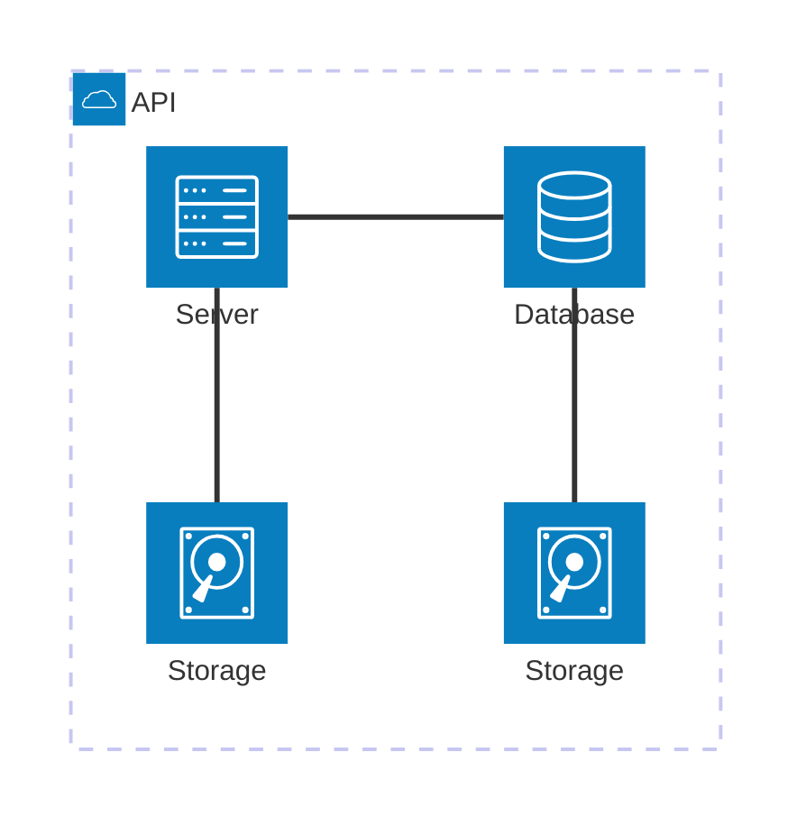
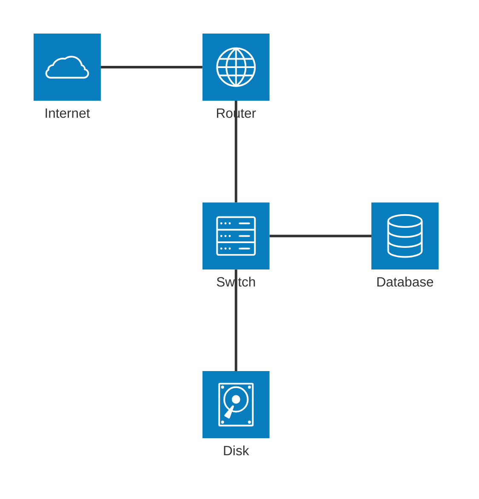

# Creating network diagrams using architecture diagrams

## Cloud
```
architecture-beta
    group api(cloud)[API]

    service db(database)[Database] in api
    service disk1(disk)[Storage] in api
    service disk2(disk)[Storage] in api
    service server(server)[Server] in api

    db:L -- R:server
    disk1:T -- B:server
    disk2:T -- B:db

```



## LAN
In its current state, architecture diagrams lack what one would think basic icons for compute and network appliances.

The icons currently supported by Mermaid are limited to:

* server
* internet
* cloud
* database
* disk

An example diagram containing each icon can be seen to low. Note that there is currently no way (besides importing additional icons) to add on PCs, VMs, containers, network interfaces, etc.

```
architecture-beta
    service internet(cloud)[Internet]
    service router(internet)[Router]
    service switch(server)[Switch]
    service database(database)[Database]
    service disk(disk)[Disk]

    internet:R -- L:router
    router:B -- T:switch
    switch:R -- L:database
    switch:B -- T:disk
```


