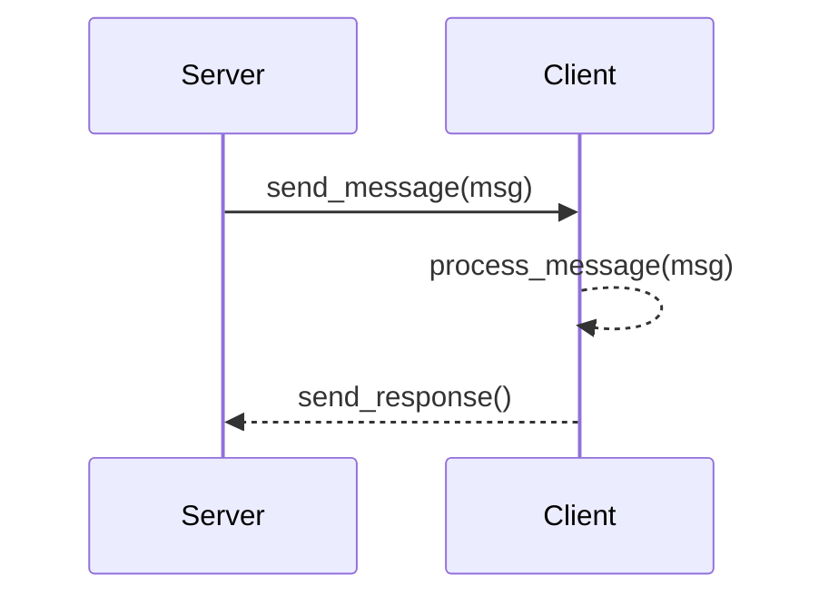

# MkDocs with Mermaid2 Plugin and Dark Mode
This sample extends the mermaid2 plugin configuration by adding support to toggle dark mode on or off. This works out of the box with mkdocs-material provided the below palette options are included in `mkdocs.yml`.
```yaml title="mkdocs.yml"
theme:
  name: material
  palette: 

    # Palette toggle for light mode
    - scheme: default
      toggle:
        icon: material/brightness-7 
        name: Switch to dark mode

    # Palette toggle for dark mode
    - scheme: slate
      toggle:
        icon: material/brightness-4
        name: Switch to light mode
```

## Sequence diagram


