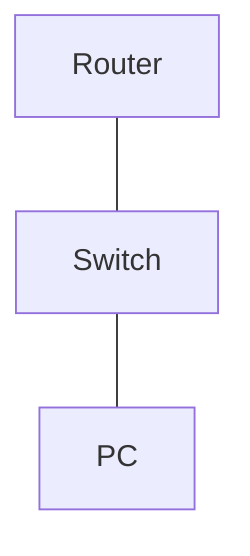
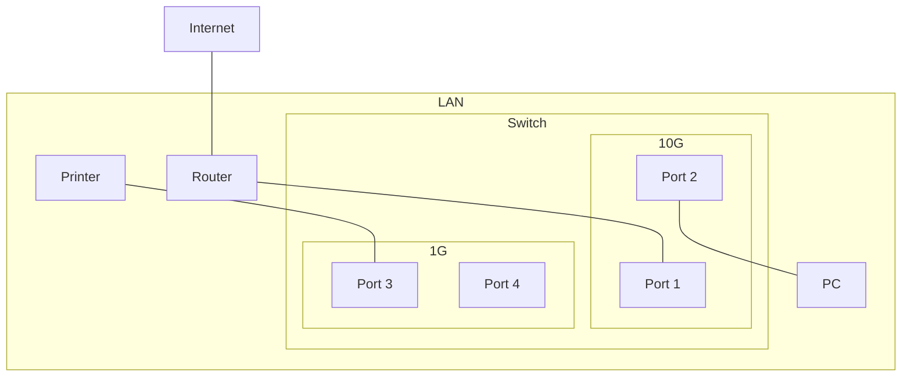
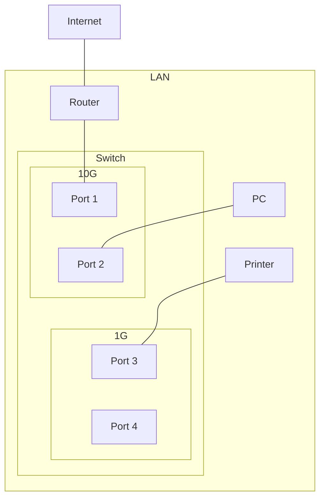
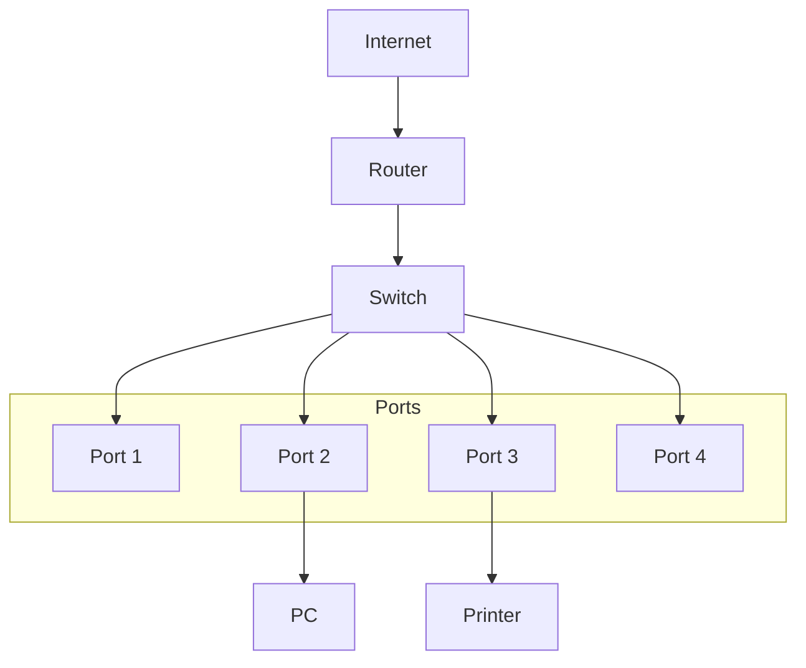
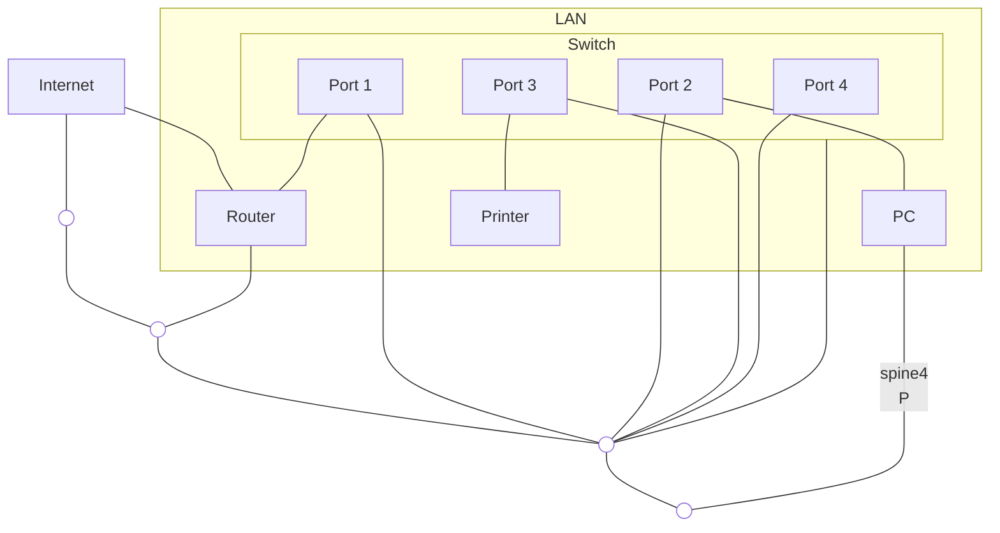

# Network diagram using graph

## Simple setup
```
graph TD
    R[Router]
    S[Switch]
    P[PC]

    R --- S --- P
```



## Detailed example
The below examples are more complex, with nested subgraphs, which lead to - as you will see - rendering issues if not handled correctly.

### Undefined structure
Notice how this example renders very poorly because we have allowed mermaid to determine the layout.

```
graph TD
    I[Internet]

    subgraph LAN
        R[Router]

        subgraph Switch
            subgraph 10G
                S1[Port 1]
                S2[Port 2]
            end
            subgraph 1G
                S3[Port 3]
                S4[Port 4]
            end
        end

        C[PC]

        P[Printer]
    end

    I --- R;
    R --- S1;
    S2 --- C;
    P --- S3;
```



### Solution: Hinting
We want/ expect our diagram to look something like this:

```
    [Internet]
        |
     [Router]
        |
        |
        |
        |          {Switch}
        |  {10G}              {1G}
      [S1]   [S2]        [S3]      [S4]
              |           |
             [PC]     [Printer]
```

We can hint at what our desired structure is by linking nodes together that are normally not be linked together. For example, although it is obvious to us, there is currently no hinting to suggest our 4 switch ports are connected.

We can correct this by using the design:
```
S1 --- S2 --- S3 --- S4;
```

Or even better:
```
S1 --- S2;
S3 --- S4;
S2 --- S3;
```

We can see that we aren't able to perfectly replicate the desired design pattern, but we are close enough, with a dramatic improvement over the previous method.



### Solution 2: Un-nest subgraphs
Nested subgraphs suck. They rarely render correctly and you have little control over them.

An alternative method is to rip nested subgraphs out of their parent graph like so:
```
graph TB

%% MAIN STRUCTURE
I[Internet]
R[Router]
SW[Switch]

I --> R --> SW

%% SWITCH PORTS (force horizontal)
subgraph Ports
direction LR
    P1[Port 1]
    P2[Port 2]
    P3[Port 3]
    P4[Port 4]
end

SW --> P1
SW --> P2
SW --> P3
SW --> P4

%% DEVICES
PC[PC]
PR[Printer]

P2 --> PC
P3 --> PR
```



### Bogus solutions
#### Spines
A "solution" that gets passed around is the idea of invisible spines that link elements together. This method is a farse, as the "invisible" spines are not invisible at all, and in fact get rendered, further muddying up your diagram.

```
graph TD
    %% Create logical "spines"
    spine1(( ))
    spine2(( ))
    spine3(( ))
    spine4(( ))

    %% Make it so the spines aren't rendered
    classDef spine fill:none,stoke:none,color:transparent;
    class spine1,spine2,spine3,spine4 spine;

    %% Connect the spines
    spine1 --- spine2
    spine2 --- spine3
    spine3 --- spine4

    I[Internet]

    subgraph LAN
        R[Router]

        subgraph S[Switch]
            S1["Port 1"]
            S2["Port 2"]
            S3["Port 3"]
            S4["Port 4"]
        end

        C[PC]

        P[Printer]
    end

    %% define what "spine" each device is connected to
    I --- spine1
    R --- spine2
    S --- spine3
    S1 --- spine3
    S2 --- spine3
    S3 --- spine3
    S4 --- spine3
    C -- spine4
    P --- spine4

    I --- R;
    S1 --- R;
    S2 --- C;
    S3 --- P;
```



