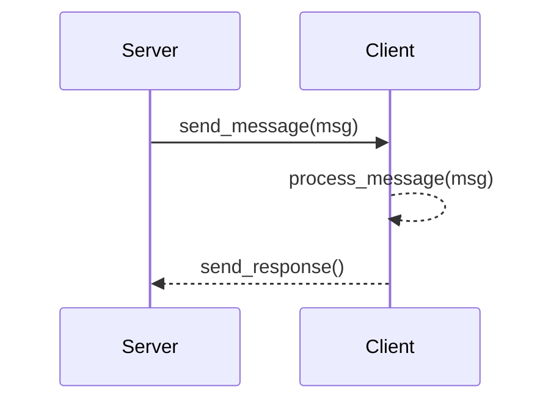

# My Docs
Welcome to my documentation page.

## Subheading
Here is a subheading. Woop woop!

Damn look at this code snippet:
``` python
import mymodule

baz = mymodule.foo(bar)
print(baz)
```

And here is a diagram. Holy shiiiit


