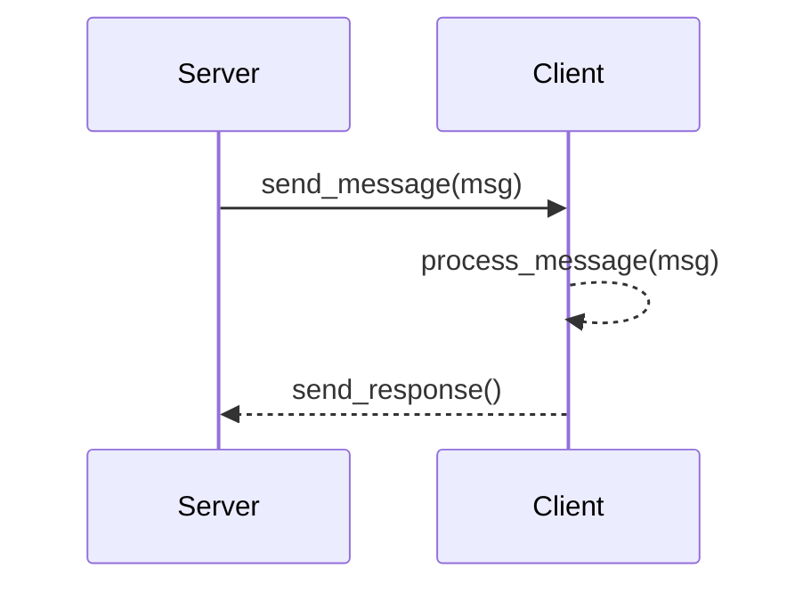

# MkDocs with Mermaid support using Mermaid2 Plugin
This configuration supports Mermaid diagrams via the Mermaid2 plugin
```title="requirements.txt"
mkdocs-mermaid2-plugin==1.1.1
```

The plugin must be included in the `mkdocs.yml`
```yaml title="mkdocs.yml"
plugins:
  - mermaid2
```

Note that the below superfences section is still required in `mkdocs.yml` in order to treat code blocks labelled `mermaid`  as mermaid diagrams.
```yaml title="mkdocs.yml"
markdown_extensions:
  - toc
  - pymdownx.superfences:
      custom_fences:
        - name: mermaid
          class: mermaid
          format: !!python/name:mermaid2.fence_mermaid_custom
```

Additionally, this option uses the awesome-plugin to automatically populate the navigation bar using a combination of filenames and the title in Heading 1 (#) of each markdown file.
```title="requirements.txt"
mkdocs-awesome-pages-plugin
```

```yaml title="mkdocs.yml"
plugins:
  - awesome-pages
```

## Sequence diagram


