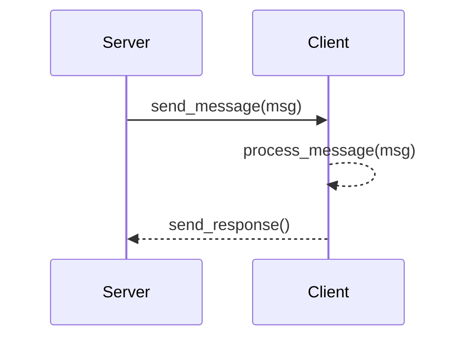

# MkDocs with Mermaid support using Superfences
This configuration supports Mermaid diagrams without needing the mermaid2 plugin

This is achieved through this section of `mkdocs.yml`
```
markdown_extensions:
  - admonition
  - codehilite
  - toc
  - pymdownx.superfences:
      custom_fences:
        - name: mermaid
          class: mermaid
          format: !!python/name:pymdownx.superfences.fence_code_format
``` 

## Sequence diagram


